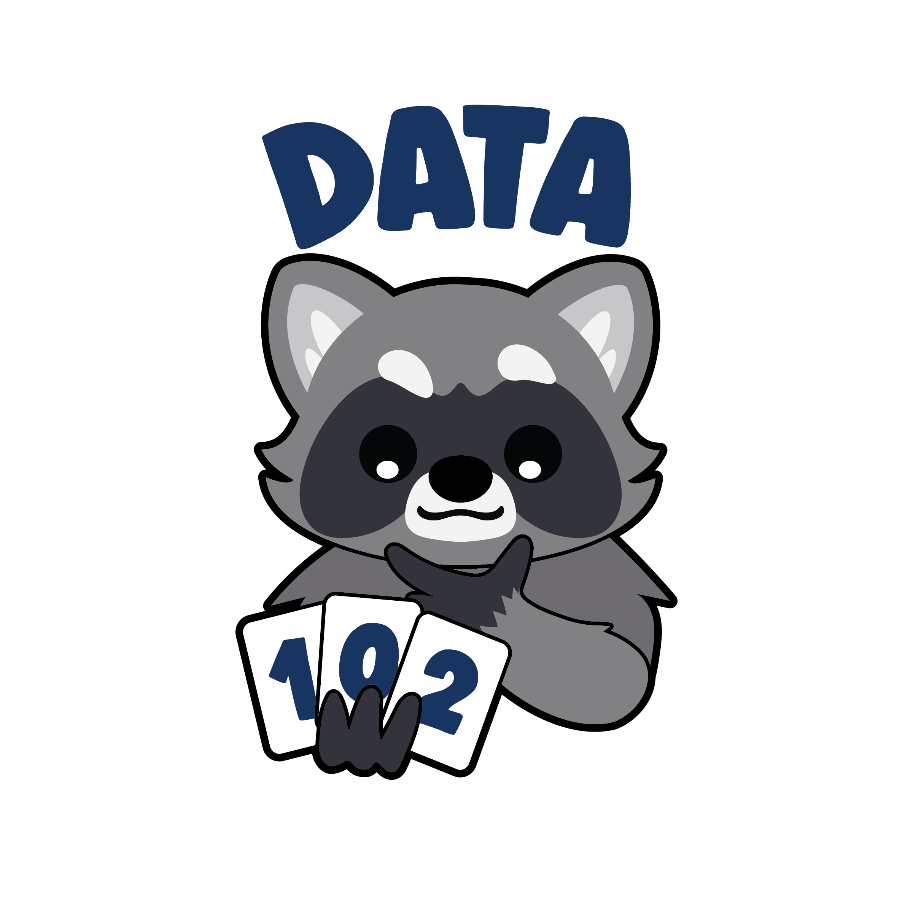

# Data 102: Data, Inference, and Decisions

## Course Description

UC Berkeley Data 102 develops the probabilistic foundations of inference in data science, and builds a comprehensive view of the modeling and decision-making life cycle in data science including its human, social, and ethical implications. Topics include: frequentist and Bayesian decision-making, permutation testing, false discovery rate, probabilistic interpretations of models, Bayesian hierarchical models, basics of experimental design, confidence intervals, causal inference, Thompson sampling, optimal control, Q-learning, differential privacy, clustering algorithms, recommendation systems and an introduction to machine learning tools including decision trees, neural networks and ensemble methods.

## Offerings
- [Spring 2025](sp25) (Ramesh Sridharan, Peng Ding)
- [Fall 2024](fa24) (Ramesh Sridharan, Alexander Strang)
- [Spring 2024](sp24) (Ramesh Sridharan, Alexander Strang)
- [Fall 2023](a23) (Ramesh Sridharan, Aditya Guntuboyina)
- [Spring 2023](sp23) (Ramesh Sridharan, Eaman Jahani)
- [Fall 2022](fa22) (Ramesh Sridharan, Jacob Steinhardt)
- [Spring 2022](sp22) (Ramesh Sridharan, Nika Haghtalab)
- [Fall 2021](fa21) (Ramesh Sridharan, Jacob Steinhardt)
- [Spring 2021](sp21) (Ramesh Sridharan, Yan Shuo Tan)
- [Fall 2020](fa20) (Michael Jordan, Jacob Steinhardt)
- [Spring 2020](sp20) (Jacob Steinhardt, Moritz Hardt)
- [Fall 2019](fa19) (Michael Jordan, Fernando Perez)

## Prerequisites

1. **Principles and Techniques of Data Science**: [Data 100](http://ds100.org/) covers important computational and statistical skills that will be necessary for Data 102.

1. **Probability**: [Data 140](https://data140.org/), [EECS 126](https://undergraduate.catalog.berkeley.edu/courses/1543161), [STAT 134](https://stat134.berkeley.edu/), [IndEng 172](https://undergraduate.catalog.berkeley.edu/courses/1105821), or [Math 106](https://undergraduate.catalog.berkeley.edu/courses/1616381).  Data 140 and EECS 126 are preferred. These courses cover the probabilistic tools that will form the underpinning for the concepts covered in Data 102.

1. **Math**: [Math 54](https://math.berkeley.edu/courses/overview/lowerdivcourses/math54), [Math 56](https://math.berkeley.edu/courses/overview/lower-division-course-outlines/math-56), [Math 110](https://undergraduate.catalog.berkeley.edu/courses/1145111), [Stat 89A](https://undergraduate.catalog.berkeley.edu/courses/1254431), [Physics 89](https://undergraduate.catalog.berkeley.edu/courses/1184991), or both of [EECS 16A](https://eecs16a.org/) and [EECS 16B](https://eecs16b.org/). We will need some basic concepts like linear operators, eigenvectors, derivatives, and integrals to enable statistical inference and derive new prediction algorithms.

